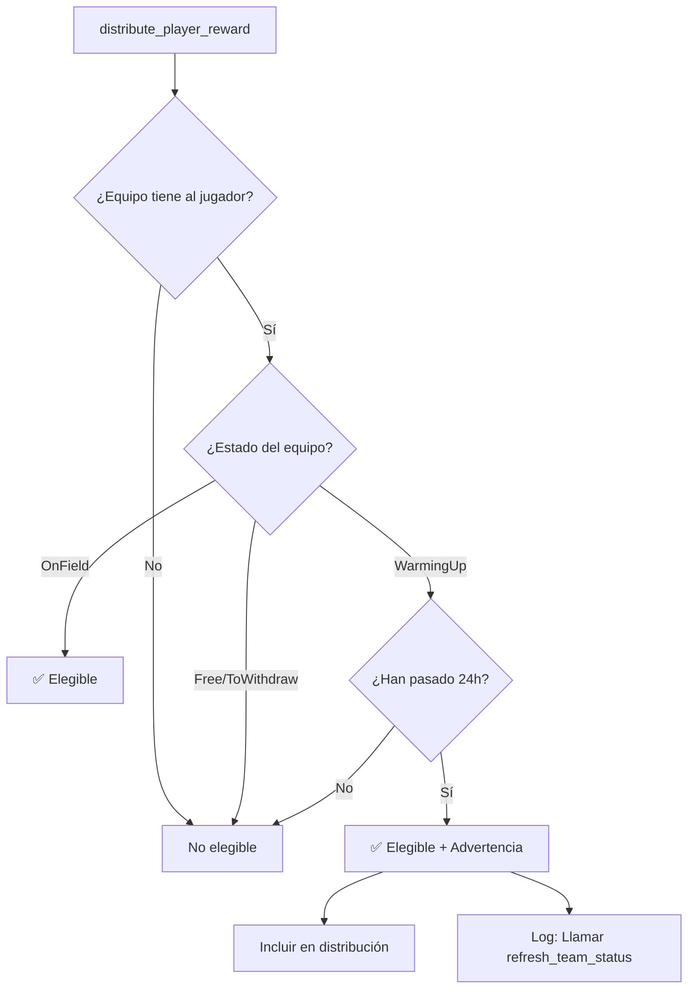
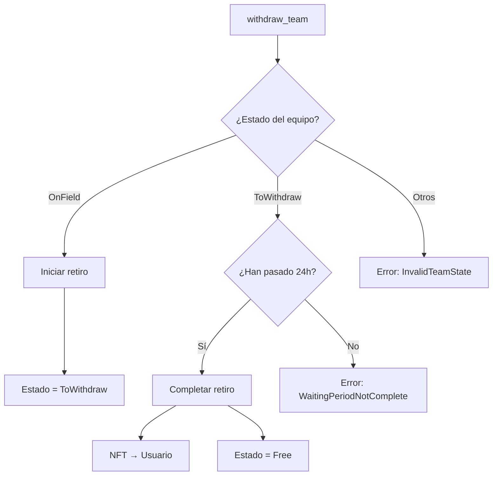

# Auto-Elegibilidad de Equipos en Estado WarmingUp

## Problema Resuelto

Anteriormente, si un equipo estaba en estado `WarmingUp` y nadie llamaba a `refresh_team_status` después de 24 horas, el equipo perdería recompensas aunque cumpliera con el requisito de tiempo.

## Solución Implementada

### 1. **Nueva Lógica de Elegibilidad**

Se agregaron tres nuevas funciones:

```rust
// Verifica si un equipo debería transicionar automáticamente
fn should_auto_transition_to_on_field(
    team: &Team,
    current_timestamp: i64,
) -> bool

// Verifica elegibilidad considerando auto-transición
fn is_team_eligible_with_auto_transition(
    team: &Team,
    player_id: u16,
    current_timestamp: i64,
) -> (bool, bool) // (es_elegible, necesita_transición)
```

### 2. **Comportamiento en `distribute_player_reward`**

Cuando se distribuyen recompensas:

1. **Verifica equipos en `WarmingUp`**: Si han pasado 24 horas desde que entraron en ese estado
2. **Los incluye automáticamente**: Estos equipos reciben su parte de las recompensas
3. **Emite advertencias**: Registra qué equipos necesitan que se llame `refresh_team_status`

### 3. **Flujo de Distribución Mejorado**



### 4. **Mensajes de Log**

Cuando se detectan equipos que necesitan transición:

```
⚠️ The following teams are in WarmingUp state for >24h and should be transitioned:
  - Team ID: 123
  - Team ID: 456
Please call refresh_team_status for these teams to complete the transition.
They are being included in the reward distribution as they meet the time requirement.
```

### 5. **Ventajas**

1. **No se pierden recompensas**: Los equipos reciben pagos aunque nadie llame a `refresh`
2. **Transparencia**: Los logs indican claramente qué equipos necesitan actualización
3. **Justicia**: Los equipos que cumplieron el tiempo de espera son recompensados
4. **Incentivo para actualizar**: Los dueños querrán llamar a `refresh` para oficializar el estado

### 6. **Ejemplo Práctico**

**Escenario**: Jugador 5 gana 100 USDC

**Equipos con Jugador 5**:
- Equipo A: `OnField` → ✅ Recibe pago
- Equipo B: `WarmingUp` (hace 25 horas) → ✅ Recibe pago + advertencia
- Equipo C: `WarmingUp` (hace 10 horas) → ❌ No recibe pago
- Equipo D: `Free` → ❌ No recibe pago

**Distribución**: 100 USDC ÷ 2 equipos elegibles = 50 USDC cada uno

### 7. **Consideraciones**

- El equipo **NO se actualiza automáticamente** en la blockchain durante la distribución
- Solo se **considera elegible** para el cálculo de recompensas
- El dueño debe llamar a `refresh_team_status` para actualizar oficialmente el estado
- Esto evita modificar cuentas que no fueron pasadas en la transacción

## Código Modificado

- **Funciones nuevas**: `should_auto_transition_to_on_field`, `is_team_eligible_with_auto_transition`
- **Función modificada**: `get_eligible_teams_from_remaining_accounts` ahora retorna equipos que necesitan transición
- **Tests agregados**: 2 nuevos tests unitarios para verificar la lógica

## Impacto

Esta mejora hace el sistema más robusto y justo, asegurando que los equipos no pierdan recompensas por falta de mantenimiento manual del estado.

## Mejora Adicional: withdraw_team Mejorado

### Funcionalidad Dual

La función `withdraw_team` ahora maneja dos casos:

1. **Iniciar Retiro** (si el equipo está en `OnField`):
   - Cambia el estado a `ToWithdraw`
   - Inicia el período de espera de 24 horas
   - Emite evento `TeamStartedWithdrawal`

2. **Completar Retiro** (si el equipo está en `ToWithdraw` y han pasado 24 horas):
   - Transfiere el NFT de vuelta al usuario
   - Cambia el estado a `Free`
   - Emite evento `TeamWithdrawn`

### Flujo Simplificado



### Ventajas

- **Una sola función**: Los usuarios no necesitan recordar llamar a `refresh_team_status`
- **Más intuitivo**: La misma función maneja todo el proceso de retiro
- **Menos transacciones**: Reduce la complejidad para el usuario final 